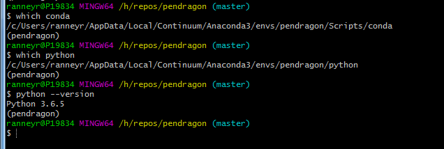
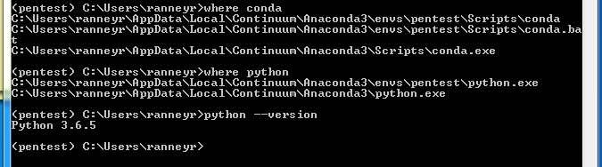
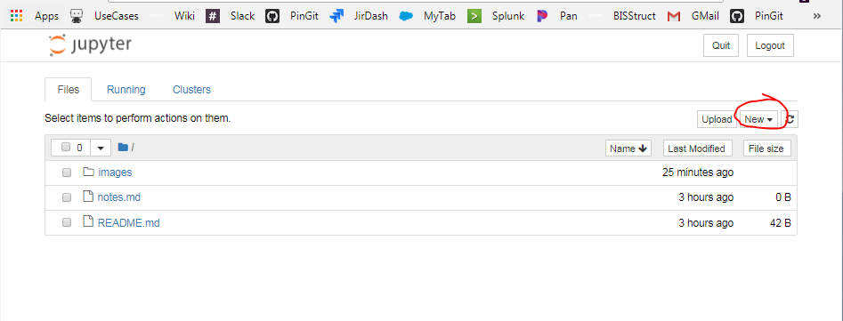
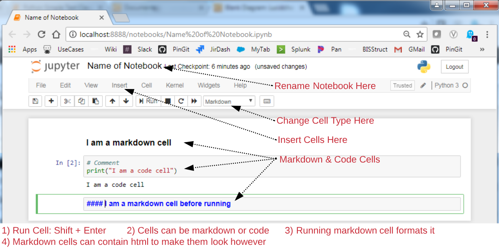

# Getting Started on Text Classification


### Things You Will Need to Get Started
For text classification with python will need a few things  
* 1) <span style="color:red">PYTHON</span>: specifically the anaconda distribution for this tutorial  
* 2) <span style="color:red">CONDA</span>: a package and environment manager, comes with anaconda  
* 3) <span style="color:red">TERMINAL TOOL</span>: Anything should work, I use git bash on windows, iterm2 on mac, but really anything should work  
* 4) <span style="color:red">GIT</span>: To pull down this repo  
* 5) <span style="color:red">BROWSER</span>: When starting a jupyter notebook it will open in your default browser  
* 6) <span style="color:red">DATA</span>: The data set for this tutorial. Since the sample data is very small it has been pushed with the repo. That usually won't be the case and it will have to be accessed separately. It is in ./data/sample_training_descs.pkl  
* optional) <span style="color:red">MARKDOWN READER</span>: If you want to read this offline, I like atom. It looks way prettier as well since github strips out all html formatting.    
* optional) <span style="color:red">TEXT EDITOR</span>: The tutorial can be done in jupyter notebooks, but still probably a good idea to have a text editor, again I prefer atom  
* optional) <span style="color:red">AN IDE</span>: If you prefer an ide over text editors there are many good python options, probably spyder is a good start.  Not necessary for tutorial.

### Step 1) Pull Down this repo
Clone this repo to wherever you want to work on it. It has the data files and python notebooks needed.

### Step 2) Installing Anaconda
* Travel to https://conda.io/miniconda.html, select the proper installer for your computer, make sure to get a python 3.6 version  
* If you prefer you can download a full anaconda install. Will get you some extra tools and things like R, Orange3, spyder  
* Keeping all the defaults of the installer should work fine  
* Installation depends on operating system.  
* Feel free to look me up on anaconda installs, hard to remember the specific pitfalls but there could be a few

### Step 3) Conda
* Conda is a package manager and environment manager. Any time it is needed to be used the command will be explained. Below are some resources if interested though.  
* Conda: https://conda.io/docs/  
* Mananging Envs: https://conda.io/docs/user-guide/tasks/manage-environments.html  

### Step 4) Setting up an environment for this
Lets set up and environment to use for this tutorial, from a termainal  

bash version  
```shell
conda create -n pendragon python=3.6 -y
source activate pendragon
```

cmd version
```shell
conda create -n pendragon pytho3.6 -y
activate pendragon
```

Can now check that proper environment is being used and proper python version  
bash version  


cmd version  



### Step 5) Add some packages
```shell
conda install jupyter ipython pandas matplotlib seaborn scikit-learn -y
pip install graphviz
```
What are the above for? Jupyter is a great way to create notebooks. These can be useful for initial exploration, or sharing and explaining code. Not that great if you actually want to make a running script, but you can kind of use them that way if you really want. Pandas is a tool for tabular data, it is built on top of numpy that is a great package for n-dimensional arrays. Matplotlib and seaborn are for making visualizations. skikit-learn is a collection of algorithms useful for machine learning tasks. Graphviz is a utility that specializes in making graphs ie nodes connected by edges. Pip is a package manager similar to how conda manages packages. Sometimes different pacakges are only avaialble from pip and it has to be used instead.


### Step 5) Open up Jupyter for walk through
```shell
cd <the root of this repository>
jupyter notebook
```

1) Click on circled button to start a new notebook  
2) Also open "Python Simple Text Classifier.ipynb" as a notebook, it looks best this way.



### Step 6) Jupyter notebook
* Build your jupyter notebook following the provided jupyter notebook tutorials
* Have Fun
* Feel free to ask me any questions about this notebook, or python, or jupyter or anything that gives you issue or just anything you are curious about.
    * robert.ranney@pinnacol.com
    * or slack or my cube


### Jupyter Tips

